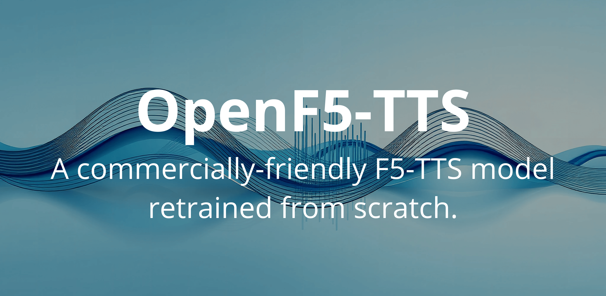

⚠️ **WORK IN PROGRESS**: This model is still in early training stages. Current checkpoints produce low-quality, garbled speech. Updated checkpoints will be released as training progresses.

# OpenF5-TTS (WIP)

A commercial-friendly version of F5-TTS retrained from scratch on permissively-licensed data.

**The model is still undergoing training. Intermediate checkpoints are available on [Hugging Face](https://huggingface.co/mrfakename/OpenF5-Intermediate) - but the model is not ready yet.**

## Model

A commercial-friendly version of F5-TTS retrained from scratch on permissively-licensed data.

Trained on the [Emilia-YODAS (CC-BY)](https://huggingface.co/datasets/amphion/Emilia-Dataset) dataset using the F5-TTS Small configuration.

## Usage

```
pip install f5-tts
huggingface-cli download mrfakename/OpenF5-Intermediate --local-dir openf5
f5-tts_infer-cli -mc openf5/model_config.yaml -p openf5/model_last.pt  -v openf5/vocab.txt
```

## Credits

* This model was trained using the amazing [F5-TTS codebase](https://github.com/SWivid/F5-TTS). Special thanks to the authors of F5-TTS for the amazing framework!
* Special thanks to Hugging Face for providing access to compute!

## License


- **Model**: [CC-BY 4.0](https://creativecommons.org/licenses/by/4.0/) - Free for commercial use
- **Scripts**: MIT License

**Note:** No restrictions are placed on usage of the outputs of the model. While attribution is appreciated, it is not required for outputs of the model.

THE MODEL IS PROVIDED “AS IS” UNDER ITS OPEN LICENSE. THE AUTHORS AND CONTRIBUTORS DISCLAIM ALL WARRANTIES, EXPRESS OR IMPLIED, INCLUDING BUT NOT LIMITED TO WARRANTIES OF MERCHANTABILITY, FITNESS FOR A PARTICULAR PURPOSE, AND NON-INFRINGEMENT. USERS ARE SOLELY RESPONSIBLE FOR ENSURING COMPLIANCE WITH APPLICABLE COPYRIGHT LAWS, INCLUDING THE USE OF INPUT DATA AND GENERATED OUTPUTS. IN NO EVENT SHALL THE AUTHORS OR CONTRIBUTORS BE LIABLE FOR ANY SPECIAL, DIRECT, INDIRECT, OR CONSEQUENTIAL DAMAGES, INCLUDING BUT NOT LIMITED TO DAMAGES RESULTING FROM LOSS OF USE, DATA, OR PROFITS, OR ANY CLAIMS RELATED TO THE MODEL’S OUTPUTS, WHETHER IN AN ACTION OF CONTRACT, NEGLIGENCE, OR OTHER TORTIOUS ACTION, ARISING OUT OF OR IN CONNECTION WITH THE USE OR PERFORMANCE OF THIS SOFTWARE.
